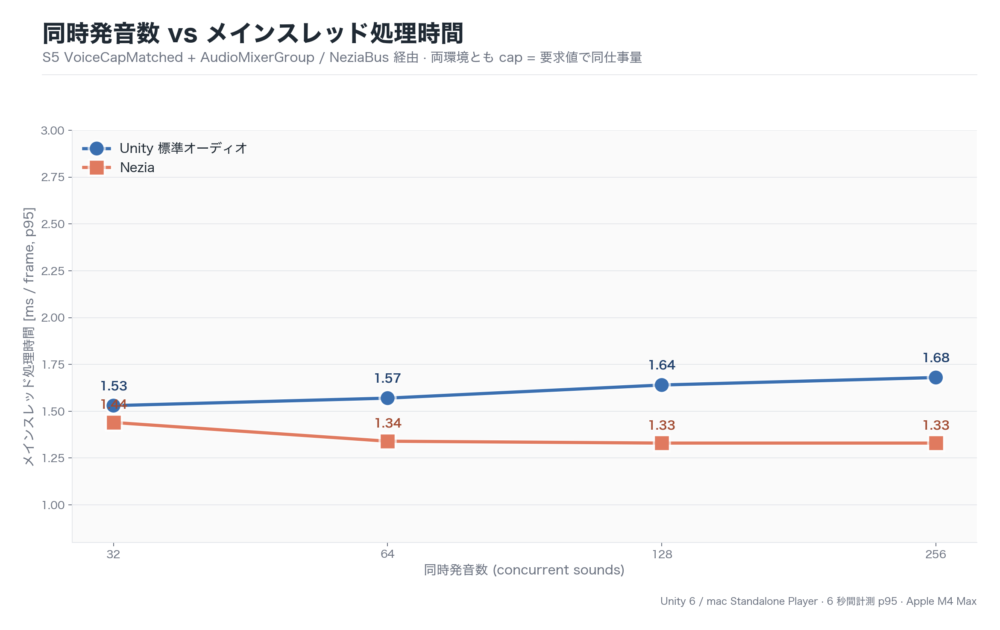

# Nezia Sound Engine (jp.nezia.unity)

Unity 向けの次世代サウンドエンジン統合層。`AudioSource` 互換 API を保ちつつ、
Wwise / FMOD のような **Clip-centric authoring**（鳴り方は Clip が決め、Source は
『いつ・どこで』だけ）を Inspector とプレハブだけで成立させることを目指す。

## インストール

### Package Manager から（ローカルパッケージ）

`Packages/manifest.json` に以下を追加:

```json
{
  "dependencies": {
    "jp.nezia.unity": "https://github.com/NeziaEngine/Nezia.Unity.git"
  }
}
```

または Unity Package Manager の **"Add package from disk..."** から
`jp.nezia.unity/package.json` を指定。

### 動作要件

- Unity **2022.3** 以降
- `com.unity.burst` 1.8.13 / `com.unity.collections` 2.4.0（自動で解決される）

### 初回セットアップ

導入後、`Assets/Settings/NeziaSettings.asset` と既定の `NeziaMixerAsset` が自動生成される。
`Project Settings > Nezia` または Project ビューで Mixer Asset を開けば、
バスツリー / Effect chain / Send 配線を Inspector から編集できる。

### サンプルのインポート

Package Manager の **Samples** タブから `Clip-centric Basics` を取り込むと、
最小コード例（`SimpleClipPlayback` / `VolumePitchScaling` / `SourceOverrideExample`）が
プロジェクトに展開される。

## Nezia の強み

### 1. 同時に何百鳴らしても重くならない

Nezia 本体（[`nezia-core`](https://github.com/NeziaEngine/nezia-core)）は
Rust で書き直した新世代のサウンドエンジン。**鳴らす音が増えても処理時間がほとんど伸びない**
のが一番の強み。下のグラフは、Unity 標準オーディオと Nezia で同時発音数を 32 → 256 まで
増やしたときの 1 フレームあたりの処理時間（小さいほど軽い）。



Unity 標準は鳴らす音を増やすほど重くなるが、Nezia は **256 同時発音でも 32 のときと同じ速度**
で走り続ける。弾幕シューティング、オープンワールド、MMO のレイドのように
「とにかく音が一斉に鳴る」場面で効いてくる。

計測条件: 両者とも Mixer / Bus 経由のフェア条件、Apple M4 Max、Unity 6 Standalone Player、6 秒間 p95。

### 2. Clip-centric authoring — 鳴り方は Clip、Source は『いつ・どこで』

Unity 標準の `AudioSource` は volume / spatialBlend / outputAudioMixerGroup などの
音響パラメータを **インスタンス側に持つ** ため、同じ音でも鳴らす場所ごとに挙動が
ばらつき、Bus ルーティングや Snapshot との整合が取りにくい。Nezia は責務を二層化する:

| レイヤ | 持つもの | 例 |
|---|---|---|
| **Clip / SoundAsset**（鳴り方） | volume / pitch / loop / outputBus / spatial / attenuationCurve / doppler / priority / effect chain / send routing | 「足音は 3D・SFX Bus・priority 192」 |
| **Source**（トリガとインスタンス） | 再生対象アセット参照 / playOnAwake / mute / volumeScale / pitchScale / position | 「このオブジェクトは playOnAwake、音量を 0.5 倍」 |

「全足音の最大距離だけ調整したい」「同じ Clip を別シーンで使い回したい」が Clip 1 つの編集で済む。

### 3. Wwise / FMOD 流の Mixer authoring を Inspector で完結

`NeziaMixerAsset` の Inspector ひとつで、バスツリー編集 / Bus ごとの Effect chain /
bus → bus の Send 配線 / Compressor sidechain（ducking）まで完結する。
Snapshot・RandomContainer・AttenuationCurve もすべて ScriptableObject 化されており、
コードでの初期化スクリプトなしで Inspector とプレハブだけでサウンドデザインが組める。
詳細は [`docs~/mixer-authoring.md`](docs~/mixer-authoring.md)。

### 4. AudioSource ドロップイン互換 + 移行ツール完備

`NeziaAudioSource` はそのまま `AudioSource` の置き換えとして使え、
`useClipDefaults=true` で Clip-centric モデルが有効になる
（`source.volume = 0.5f` は Clip 基準音量への乗算として動く、個別パラメータは
Override トグル / 直接代入でインスタンス側強制可能 — Cinemachine / HDRP Volume 風 UX）。
既存資産も `Tools > Nezia > Replace AudioSources With NeziaAudioSource` /
`Convert Selection to Clip-centric Mode` で挙動を完全保存したまま移行できる。

## 使い方

### クイックスタート

1. **Mixer Asset を確認 / 編集**
   `Assets/Settings/NeziaSettings.asset` と既定 Mixer は自動生成される。
   `Project Settings > Nezia` または Project ビューから `NeziaMixerAsset` を選択し、
   バス階層・Effect chain・Send 配線を Inspector で組む。
2. **Clip を取り込む**
   `.wav` / `.ogg` / `.flac` / `.mp3` を Project に D&D すると、自動で
   `NeziaAudioClip` として import される。
3. **Clip の音響設定を編集**
   Inspector で volume / pitch / outputBus / spatial / effect chain / aux send を設定。
   この設定が「鳴り方」の単一ソースになる。
4. **`NeziaAudioSource` を GameObject に追加**
   Clip を D&D し、`Use Clip Defaults` を **ON**。
5. **コードからは再生トリガだけ**
   鳴り方の調整はすべて Clip Inspector に戻して行う。

### コード例 — 最小再生

```csharp
using Nezia.Unity;

// 鳴り方は Clip 側で設定済み（volume / outputBus / 距離 / effect chain / send）。
// Source 側は「いつ・どこで・どのインスタンスで」だけを書く。
var src = gameObject.AddComponent<NeziaAudioSource>();
src.sound = footstepClip;       // NeziaAudioClip / NeziaRandomContainer
src.useClipDefaults = true;     // Clip-centric を有効化
src.volume = 0.5f;              // Clip 基準値への乗算 (scale) として効く
src.Play();
```

### コード例 — インスタンス側 override

```csharp
// この GameObject だけ完全 3D で鳴らしたい場合
src.spatialBlend = 1f;          // 直接代入で override flag が暗黙に立つ
src.outputBus = bossRoomBus;    // outputBus も Source 側強制
```

### コード例 — 一括停止

```csharp
// 同じ Clip / 同じ Bus に紐付くソースをまとめて停止
NeziaAudioSource.StopMany(footstepSources);
```

### よくあるパターン

- **足音などランダム再生**: `NeziaRandomContainer` を作り、Variant Clip を登録 →
  Source の `sound` にコンテナを D&D
- **状況に応じた音場切替**: `NeziaSnapshotAsset` に Bus パラメータを保存し、
  コードから `Apply()` で滑らかに遷移
- **距離減衰の共有**: `NeziaAttenuationCurveAsset` を Clip 群で共有し、
  「全足音の最大距離」など 1 箇所で調整

### 関連ドキュメント

- Mixer authoring: [`docs~/mixer-authoring.md`](docs~/mixer-authoring.md)
- 移行ガイド: [`docs~/migration/clip-centric.md`](docs~/migration/clip-centric.md)
- ロードマップ: [`docs~/roadmap/integration-experience.md`](docs~/roadmap/integration-experience.md)
- 変更履歴: [`CHANGELOG.md`](CHANGELOG.md)

## パッケージ構成

- `Runtime/` — ランタイムコード (`Nezia.Unity` 名前空間)
- `Editor/` — エディタ拡張 (`Nezia.Unity.Editor` 名前空間)
- `Tests/Runtime/`, `Tests/Editor/` — テスト
- `Samples~/` — Package Manager から取り込めるサンプル
- `docs~/` — 設計ドキュメント・ロードマップ・移行ガイド
